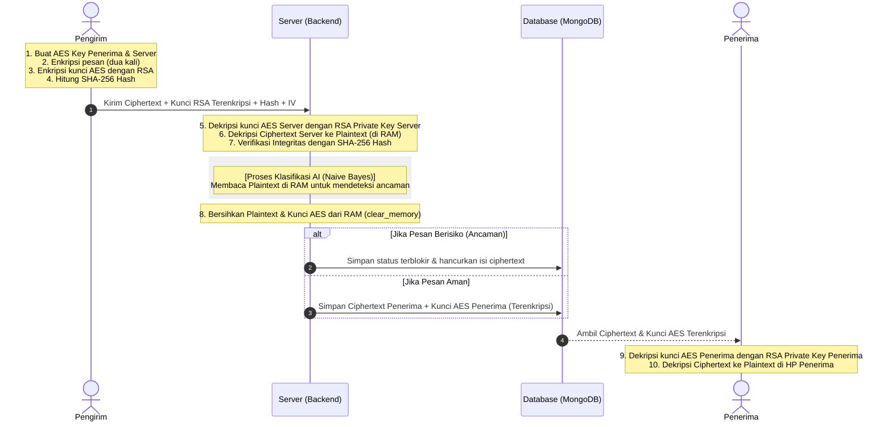
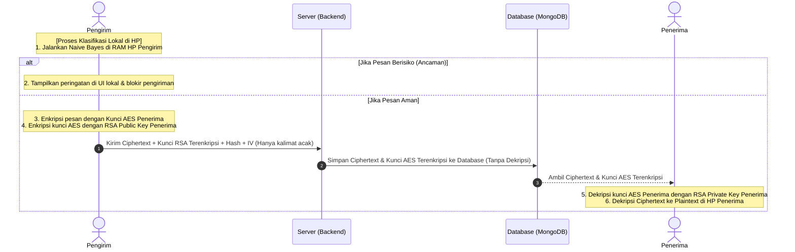

# Analisis & Penjelasan Sistem Pengamanan Data ChatKu

Dokumen ini menjelaskan arsitektur keamanan, alur enkripsi ganda (*Dual Encryption*), dan mekanisme klasifikasi pesan siber berbasis memori (*Volatile RAM*) yang diterapkan pada aplikasi ChatKu.

---

## 1. Arsitektur Keamanan: Privasi vs Keamanan Aktif
Aplikasi ChatKu menerapkan pendekatan **Hybrid Security Architecture**. Di satu sisi, aplikasi ini melindungi privasi pengguna seperti WhatsApp (menggunakan enkripsi ujung-ke-ujung), namun di sisi lain, aplikasi memiliki sistem pertahanan aktif yang mampu menyaring konten berbahaya secara otomatis menggunakan AI sebelum pesan disimpan secara permanen.

---

## 2. Alur Enkripsi Ganda (Dual Encryption)

Enkripsi ganda memastikan bahwa server dapat memeriksa pesan tanpa pernah menyimpan pesan asli tersebut ke dalam database.

### A. Di Sisi Client (Frontend - `encryptionService.ts`)
Sebelum pesan dikirim melalui jaringan, aplikasi di handphone/browser pengirim melakukan langkah berikut:
1. **Generasi Kunci Sementara:** Sistem menghasilkan kunci simetris **AES-256** dan **IV** secara acak.
2. **Double Encryption:**
   * Pesan asli dienkripsi dengan kunci AES Penerima $\rightarrow$ **`ciphertextUser`**.
   * Pesan asli dienkripsi dengan kunci AES Server $\rightarrow$ **`ciphertextServer`**.
3. **Asymmetric Key Wrapping (RSA):**
   * Kunci AES Penerima dikunci menggunakan **RSA Public Key Penerima** $\rightarrow$ **`encryptedUserKey`**.
   * Kunci AES Server dikunci menggunakan **RSA Public Key Server** $\rightarrow$ **`encryptedServerKey`**.
   * Kunci AES Penerima dikunci menggunakan **RSA Public Key Pengirim** $\rightarrow$ **`encryptedSenderKey`** (agar pengirim bisa membaca riwayat chat-nya sendiri).
4. **Hashing:** Pesan asli di-hash dengan algoritma **SHA-256** $\rightarrow$ **`message_hash`**.

Semua komponen tersebut dikirim ke server. Teks asli (plaintext) tidak pernah dikirim secara langsung.

### B. Di Sisi Server (Backend - `chat_service.py`)
Saat server menerima payload:
1. **Dekripsi Sementara:** Server mendekripsi `encryptedServerKey` menggunakan **RSA Private Key Server** miliknya sendiri untuk mendapatkan kunci AES Server.
2. **Membaca Pesan:** Server mendekripsi `ciphertextServer` menggunakan kunci AES tersebut untuk mendapatkan **plaintext** asli.
3. **Verifikasi Hash:** Server menghitung ulang hash dari plaintext dan membandingkannya dengan `message_hash` dari pengirim untuk memastikan pesan tidak dimanipulasi (*integrity check*).

---

## 3. Proses Klasifikasi Berbasis Memori (Volatile RAM)

Untuk memenuhi syarat bahwa **"Server tidak boleh menyimpan atau melihat pesan dalam bentuk teks biasa"**, server mengadopsi mekanisme *In-Memory Processing* (pemrosesan murni di RAM) menggunakan konsep *Virtual RAM*:

* **Tidak Menyentuh Disk (No Disk Footprint):**
  Proses dekripsi pesan ke bentuk plaintext hanya terjadi di memori kerja (RAM) server. Server tidak pernah menulis file sementara (temporary files) atau cache ke SSD/Harddisk.
* **Klasifikasi Instan:**
  Plaintext di memori RAM dibaca oleh model **Naïve Bayes** dan sistem penyaringan kata (*Safety Net*) di `classification_service.py` untuk menentukan label apakah pesan **"Berisiko"** atau **"Tidak Berisiko"**.
* **Pembersihan Memori Kerja (`clear_memory`):**
  Setelah klasifikasi selesai, server langsung memanggil fungsi `clear_memory(plaintext, server_key)` untuk menimpa blok memori tersebut dengan nilai `0` (null byte). Hal ini mencegah data plaintext tertinggal di RAM (*RAM leakage*) yang dapat dieksploitasi lewat teknik analisis memori/forensik.

---

## 4. Keadaan Data di Berbagai Lokasi (State of Data)

Berikut adalah ringkasan bentuk pesan pada setiap komponen sistem:

| Lokasi / Status | Bentuk Pesan Pengguna | Kunci AES Dekripsi | Keterangan Keamanan |
| :--- | :--- | :--- | :--- |
| **HP Pengirim (RAM)** | Teks Biasa (Plaintext) | Ada (Plaintext) | Data berada di memori aman perangkat milik pengguna sendiri. |
| **Dalam Perjalanan (Transit)** | Ciphertext (Acak) | Terkunci (RSA Encrypted) | Terlindungi dari penyadapan jaringan (*Man-in-the-Middle Attack*). |
| **RAM Server (Sementara)** | Teks Biasa (Plaintext) | Ada (Plaintext) | Hanya aktif beberapa milidetik selama klasifikasi AI, lalu segera dihapus murni (`clear_memory`). |
| **Database MongoDB** | Ciphertext (Acak) | Terkunci (RSA Encrypted) | Jika database diretas atau admin mengintip, isi pesan tidak bisa dibaca sama sekali. |
| **HP Penerima (RAM)** | Teks Biasa (Plaintext) | Ada (Plaintext) | Didekripsi secara lokal menggunakan kunci privat penerima. |

---

## 5. Mekanisme Penghancuran Pesan Berbahaya
Jika hasil klasifikasi AI menyatakan pesan tersebut **"Berisiko"** (mengandung ancaman keamanan siber):
1. Server langsung **menolak dan menghancurkan** data `ciphertextUser` yang dikirimkan.
2. Server mengganti isi pesan di database menjadi teks peringatan sistem: `[KONTEN BERBAHAYA TELAH DIHANCURKAN OLEH SISTEM ⚠️]`.
3. Kunci AES penerima diganti menjadi `"DESTROYED_FOR_SAFETY"`, sehingga konten asli pesan berbahaya tersebut tidak akan pernah bisa didekripsi oleh siapa pun lagi.

---

## 6. Alternatif Arsitektur: Enkripsi Ujung-ke-Ujung (E2EE) Murni & Klasifikasi Sisi Klien (Client-Side)

Jika prioritas utama sistem adalah **privasi mutlak** (seperti WhatsApp), di mana server sama sekali tidak boleh dan tidak bisa mendekripsi pesan pengirim untuk alasan apa pun, arsitektur harus diubah ke **Client-Side Classification (Klasifikasi Sisi Klien)**.

### A. Alur Kerja E2EE Murni + Klasifikasi Klien
Dalam arsitektur ini:
1. **Model AI Ringan di HP:** Model klasifikasi (Naïve Bayes dan daftar kata kasar) disimpan langsung di dalam aplikasi HP/Browser pengguna.
2. **Pencegahan Lokal:** Sebelum pesan dikirim, aplikasi frontend memproses teks tersebut menggunakan RAM HP pengirim.
3. **Penyaringan Instan:** 
   * Jika model mendeteksi pesan **Berisiko**: Aplikasi di HP langsung membatalkan pengiriman pesan dan memberikan peringatan kepada pengguna.
   * Jika model mendeteksi pesan **Aman**: Pesan dienkripsi dengan kunci AES penerima, lalu dikirim ke server.
4. **Server Buta:** Server hanya menerima `ciphertextUser`, `encryptedUserKey`, `iv`, dan `hash`. Server tidak menerima kunci server (`encryptedServerKey`) dan tidak melakukan dekripsi apa pun.

### B. Diagram Alur Alternatif (Client-Side Classification)

### C. Perbandingan Arsitektur: Sisi Server vs Sisi Klien

| Parameter | Sisi Server (Arsitektur Saat Ini) | Sisi Klien (Alternatif E2EE Murni) |
| :--- | :--- | :--- |
| **Kerahasiaan Pesan di Server** | Server sempat mendekripsi di RAM untuk dibaca AI, lalu dihapus. | Server 100% tidak bisa mendekripsi (Hanya melihat kalimat acak). |
| **Resistensi terhadap Bypass** | **Tinggi.** Pengguna tidak bisa mengubah kode AI di server. | **Rendah.** Pengguna mahir bisa memodifikasi APK untuk mem-bypass filter AI. |
| **Pembaruan Model AI** | **Sangat Mudah.** Cukup ganti file model di server. | **Sulit.** Harus update aplikasi melalui Play Store / App Store. |
| **Beban Komputasi Server** | Sedikit lebih berat karena harus memproses NLP. | Sangat ringan karena server hanya melakukan routing data. |
| **Kinerja Aplikasi HP** | Sangat ringan karena HP hanya melakukan enkripsi biasa. | Sedikit beban RAM untuk menjalankan stemming bahasa lokal (Sastrawi). |

### D. Kelayakan Implementasi Naïve Bayes di HP (React Native)
**Sangat layak.** Naïve Bayes adalah algoritma berbasis statistik probabilistik sederhana yang hanya melibatkan operasi perkalian dan pertambahan matematika dasar. Mengonversi model Naïve Bayes ke format JSON dan menjalankannya dengan JavaScript/TypeScript di React Native sangatlah ringan dan tidak akan membuat aplikasi lambat (hanya butuh waktu < 10ms untuk memproses satu kalimat chat).

---

## Kesimpulan Keamanan Akademik
Arsitektur ini membuktikan bahwa:
* **Aspek Confidentiality (Kerahasiaan):** Terpenuhi karena database server hanya menyimpan data terenkripsi. Pada model E2EE murni, kerahasiaan ini bernilai mutlak karena kunci dekripsi didelegasikan sepenuhnya pada pihak client.
* **Aspek Integrity (Integritas):** Terpenuhi dengan pencocokan satu arah nilai hash SHA-256 baik pada arsitektur server-side maupun client-side.
* **Aspek Non-repudiation (Anti-penyangkalan):** Terpenuhi karena kunci enkripsi terikat dengan pasangan kunci RSA masing-masing pengguna.
* **Aspek Keamanan Forensik:** Terpenuhi dengan membatasi dekripsi teks hanya pada memori kerja volatile (RAM) pengirim/penerima atau RAM server sementara.

